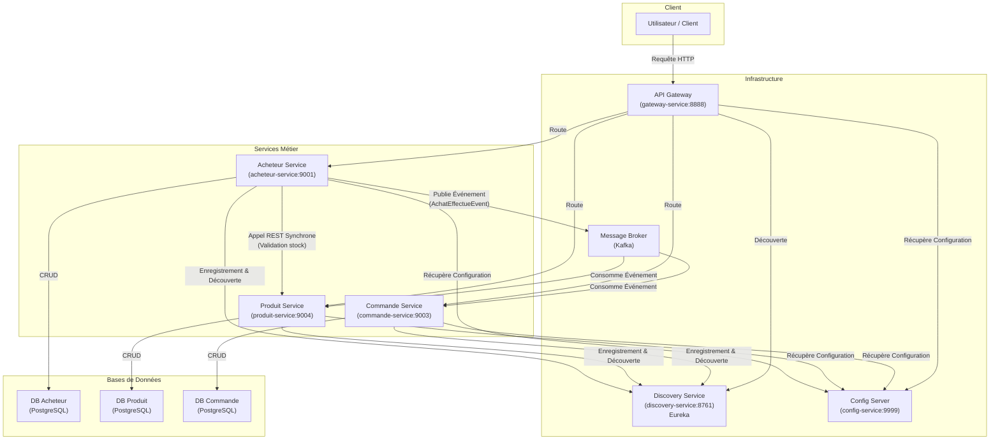

# Architecture Microservices

Ce projet est une démonstration d'une architecture microservices basée sur Spring Boot et Spring Cloud. Il simule une application e-commerce simple avec des services pour les acheteurs, les produits et les commandes.

## Schéma de l'Architecture

Le schéma ci-dessous illustre les différents composants de l'architecture et leurs interactions.



## Description des Services

### Services d'Infrastructure

* **API Gateway (`gateway-service`)** : Point d'entrée unique pour toutes les requêtes des clients. Il gère le routage dynamique vers les services métier en s'appuyant sur le Discovery Service.

* **Discovery Service (`discovery-service`)** : Annuaire de services (Eureka) où chaque microservice s'enregistre. Cela permet une découverte dynamique des instances de service.

* **Config Server (`config-service`)** : Centralise la gestion de la configuration pour tous les microservices. Les configurations sont stockées dans le répertoire `micro-config`.

* **Message Broker (Kafka)** : Utilisé pour la communication asynchrone et événementielle entre les services, permettant de les découpler.

### Services Métier

* **Acheteur Service (`acheteur-service`)** : Gère les informations des acheteurs (création, lecture, mise à jour, suppression). Il initie le processus d'achat.

* **Produit Service (`produit-service`)** : Gère le catalogue des produits, y compris les informations sur le stock.

* **Commande Service (`commande-service`)** : Gère la création et le suivi des commandes.

## Flux de Communication

Le système utilise deux principaux modes de communication :

1. **Communication Synchrone (REST)** : Utilisée pour les requêtes qui nécessitent une réponse immédiate. Par exemple, lorsque `acheteur-service` vérifie le stock disponible auprès du `produit-service` avant de valider un achat. Cette communication est facilitée par OpenFeign.

2. **Communication Asynchrone (Événementielle avec Kafka)** : Utilisée pour découpler les services. Lorsqu'un achat est effectué, `acheteur-service` publie un événement `AchatEffectueEvent`. Le `commande-service` et le `produit-service` consomment cet événement pour respectivement créer une commande et décrémenter le stock.

## Prérequis

* Docker et Docker Compose
* JDK 17 ou supérieur
* Maven 3.6 ou supérieur

## Démarrage

### 1. Lancer l'infrastructure

```bash
docker-compose up -d
```

Cette commande démarre Zookeeper et Kafka.

### 2. Lancer les services

Démarrez chaque service Spring Boot via votre IDE ou en utilisant Maven :

```bash
# Pour chaque service
mvn spring-boot:run
```

**Ordre de démarrage recommandé :**

1. `config-service` (port 9999)
2. `discovery-service` (port 8761)
3. `gateway-service` (port 8888)
4. Les services métier dans n'importe quel ordre :
   - `acheteur-service` (port 9001)
   - `produit-service` (port 9004)
   - `commande-service` (port 9003)

### 3. Vérification

* **Eureka Dashboard** : http://localhost:8761
* **API Gateway** : http://localhost:8888
* **Config Server** : http://localhost:9999

## Points d'accès API

Une fois tous les services démarrés, vous pouvez accéder aux APIs via la Gateway :

* **Acheteurs** : http://localhost:8888/acheteurs
* **Produits** : http://localhost:8888/produits
* **Commandes** : http://localhost:8888/commandes

## Architecture et Bonnes Pratiques

Ce projet illustre plusieurs patterns et bonnes pratiques des architectures microservices :

* **Service Discovery** avec Eureka
* **Configuration centralisée** avec Spring Cloud Config
* **API Gateway** pour le routage et la sécurité
* **Communication asynchrone** avec Apache Kafka
* **Séparation des préoccupations** avec des bases de données dédiées
* **Découplage** entre les services via les événements
